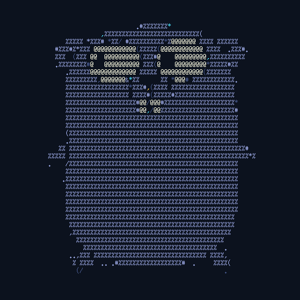

# gopherlix

A Server for the Gopher protocol, written in the Go.

  

## Usage

To start the server create a directory with you content. At the moment only
textfiles and directories are supported.

The client will be able to request paths. Text files will be rendered in the
client's browser and directories will return a listing of all files in them.

### Custom gophermaps

To show custom content instead of the generated directory listing for a
requested directory, place a file named `index.gph` in it. It will be shown
instead of the default listing.
